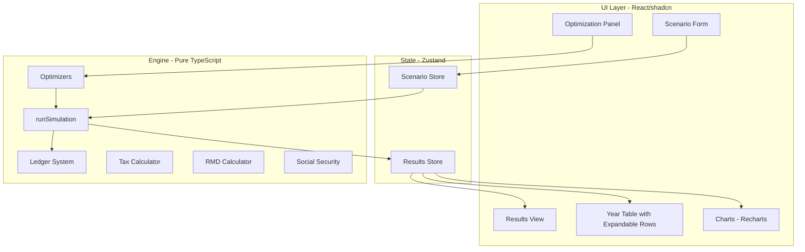

# Retirement Portfolio Drawdown Optimizer - Full Implementation Plan

This plan rebuilds the POC from scratch with a mature architecture while maintaining simplicity. The core principle is **separation of concerns**: a pure TypeScript engine handles all financial calculations, while React/shadcn handles presentation only.---

## Architecture Overview



---

## Part 1: Engine Layer (Pure TypeScript)

All engine code lives in `lib/engine/` with zero React/DOM dependencies. This makes it testable, portable, and future-ready for Web Workers.

### 1.1 Type Definitions (`lib/engine/types.ts`)

```typescript
// === SCENARIO INPUTS ===
interface Scenario {
  // Personal
  startAge: number;           // e.g., 62
  endAge: number;             // e.g., 95
  
  // Account Balances (at startAge)
  iraBalance: number;
  rothBalance: number;
  taxableBalance: number;
  taxableBasisValue: number;  // Derived from costBasisPct * taxableBalance
  cashBalance: number;
  
  // Economic Assumptions
  investmentReturn: number;   // e.g., 0.07 for 7%
  cashReturn: number;         // e.g., 0.03 for 3%
  inflationRate: number;      // e.g., 0.03 for 3%
  
  // Tax Rates (flat, single filer)
  ordinaryIncomeRate: number; // e.g., 0.22 for 22%
  capitalGainsRate: number;   // e.g., 0.15 for 15%
  
  // Spending
  spendingPhases: SpendingPhase[];
  oneOffExpenses: OneOffExpense[];
  
  // Social Security
  ssAnnualBenefit: number;    // Today's dollars (age 67 FRA amount)
  ssClaimAge: number;         // 62-70
  
  // Policies
  withdrawalOrder: AccountType[];  // e.g., ['cash', 'taxable', 'ira', 'roth']
  taxPaymentOrder: AccountType[];  // e.g., ['cash', 'taxable', 'ira']
  
  // Roth Conversion Strategy
  rothConversionAmount: number;    // Annual amount
  rothConversionStartAge: number;
  rothConversionEndAge: number;
  
  // Valuation Assumptions
  assumedIraTaxRate: number;  // For TANW calculation (what rate to discount IRA)
}

type AccountType = 'ira' | 'roth' | 'taxable' | 'cash';

interface SpendingPhase {
  fromAge: number;
  toAge: number;           // inclusive
  annualAmount: number;    // Today's dollars
  label?: string;          // e.g., "Go-Go Years"
}

interface OneOffExpense {
  age: number;
  amount: number;          // Today's dollars
  note: string;            // e.g., "New roof"
}
```


### 1.2 Ledger System (`lib/engine/ledger.ts`)

The ledger records every financial movement for auditability. Each year has multiple entries that can be filtered and displayed.

```typescript
type LedgerEntryType = 
  | 'income'           // SS, other income
  | 'withdrawal'       // Money out of an account
  | 'deposit'          // Money into an account (reinvestment)
  | 'transfer'         // Roth conversion (IRA to Roth, no cash)
  | 'tax_accrual'      // Tax owed (attribution shows source)
  | 'tax_payment'      // Tax paid (payer shows which account)
  | 'growth';          // Investment returns

type Purpose = 
  | 'spending'         // Withdrawal to fund spending
  | 'tax'              // Withdrawal to pay taxes
  | 'conversion'       // Roth conversion
  | 'rmd'              // RMD requirement
  | 'reinvest'         // Surplus reinvested
  | 'income';          // Income received

type Attribution =
  | 'ira_distribution'
  | 'roth_withdrawal'
  | 'taxable_sale'
  | 'cash_withdrawal'
  | 'social_security'
  | 'roth_conversion'
  | 'capital_gains'
  | 'interest';

interface LedgerEntry {
  id: string;                    // Unique ID for React keys
  yearIndex: number;             // 0 = startAge year
  age: number;
  phase: 'spending' | 'rmd' | 'conversion' | 'tax_settlement' | 'reinvest' | 'growth';
  type: LedgerEntryType;
  
  // Amounts
  amountGross: number;
  amountNet?: number;            // After embedded taxes
  
  // Account involved
  account?: AccountType;
  accountFrom?: AccountType;     // For transfers
  accountTo?: AccountType;
  
  // Tax info (for tax_accrual and tax_payment)
  taxOrdinary?: number;
  taxCapGains?: number;
  
  // Tags for filtering/grouping
  purpose: Purpose;
  attribution?: Attribution;
  
  // Human-readable description
  description: string;
}
```

**Ledger Creation Pattern:**

```typescript
function createLedgerEntry(
  base: Omit<LedgerEntry, 'id'>,
): LedgerEntry {
  return { ...base, id: crypto.randomUUID() };
}
```


### 1.3 Year Row Structure (`lib/engine/types.ts` continued)

The `YearRow` is the pre-computed, UI-ready data for each year. The UI never computes financial values - it only renders what the engine provides.

```typescript
interface YearRow {
  yearIndex: number;
  age: number;
  
  // === BALANCES (End of Year) ===
  iraEnd: number;
  rothEnd: number;
  taxableEnd: number;
  cashEnd: number;
  totalEnd: number;
  
  // === SPENDING ===
  spendingNeed: number;           // Total spending required this year
  spendingComponents: {           // Breakdown for tooltips
    baseSpending: number;
    oneOffExpenses: number;
    totalBeforeIncome: number;
    ssIncome: number;             // Reduces spending need
    netSpendingNeed: number;
  };
  spendingFundedFrom: {           // Net amounts after embedded taxes
    cash: number;
    taxable: number;
    ira: number;
    roth: number;
  };
  spendingShortfall: number;      // If accounts ran out
  
  // === TAXES OWED (by source/attribution) ===
  taxOwedOrdinary: number;        // Total ordinary income tax
  taxOwedCapGains: number;        // Total capital gains tax
  taxOwedTotal: number;
  taxSources: {                   // What created the taxes
    iraDistributions: number;
    rothConversion: number;
    ssTaxable: number;
    capitalGains: number;
    cashInterest: number;
  };
  
  // === TAXES PAID (by payer account) ===
  taxPaidFrom: {                  // Gross amounts withdrawn to pay taxes
    cash: number;
    taxable: number;
    ira: number;
  };
  
  // === IRA ACTIVITY ===
  iraDistributionsPlanned: number;  // IRA used for spending + tax payments
  rmdRequired: number;              // IRS requirement
  rmdForced: number;                // max(0, rmdRequired - iraDistributionsPlanned)
  iraDistributionsActual: number;   // Total gross IRA distributions
  rmdSurplusReinvested: number;     // Excess reinvested to taxable
  rothConversion: number;           // Does NOT count toward RMD
  
  // === SOCIAL SECURITY ===
  ssGross: number;
  ssTaxable: number;
  ssEffectiveRate: number;          // ssTaxable / ssGross (for display)
  
  // === GROWTH ===
  growth: {
    ira: number;
    roth: number;
    taxable: number;
    cash: number;
    total: number;
  };
  
  // === VALUATION ===
  tanw: number;                     // Tax-Adjusted Net Worth
  tanwComponents: {
    iraAfterTax: number;
    rothAfterTax: number;
    taxableAfterTax: number;
    cashAfterTax: number;
  };
}
```


### 1.4 Simulation Result Structure

```typescript
interface SimulationResult {
  scenario: Scenario;             // Input scenario (for comparison)
  yearRows: YearRow[];            // Main table data
  ledger: LedgerEntry[];          // Full audit trail
  
  // Summary metrics
  summary: {
    finalTotal: number;
    finalTanw: number;
    totalTaxesPaid: number;
    totalOrdinaryTax: number;
    totalCapGainsTax: number;
    totalConverted: number;
    totalRmds: number;
    totalSpendingShortfall: number;
    worstShortfallYear: number | null;
  };
  
  // For quick ledger lookups by year
  ledgerByYear: Map<number, LedgerEntry[]>;
}
```


### 1.5 RMD Calculator (`lib/engine/rmd.ts`)

```typescript
// IRS Uniform Lifetime Table (2024+)
const RMD_DIVISORS: Record<number, number> = {
  72: 27.4, 73: 26.5, 74: 25.5, 75: 24.6, 76: 23.7, 77: 22.9,
  78: 22.0, 79: 21.1, 80: 20.2, 81: 19.4, 82: 18.5, 83: 17.7,
  84: 16.8, 85: 16.0, 86: 15.2, 87: 14.4, 88: 13.7, 89: 12.9,
  90: 12.2, 91: 11.5, 92: 10.8, 93: 10.1, 94: 9.5, 95: 8.9,
  // Ages 96+ use 8.4 and decrease
};

const RMD_START_AGE = 73; // SECURE Act 2.0

export function calculateRMD(age: number, priorYearIraBalance: number): number {
  if (age < RMD_START_AGE || priorYearIraBalance <= 0) return 0;
  const divisor = RMD_DIVISORS[age] ?? Math.max(8.4 - (age - 96) * 0.5, 1);
  return priorYearIraBalance / divisor;
}
```


### 1.6 Social Security Calculator (`lib/engine/social-security.ts`)

Simplified but realistic SS modeling with taxability.

```typescript
// Claiming age adjustment factors (relative to FRA of 67)
const SS_ADJUSTMENT_FACTORS: Record<number, number> = {
  62: 0.70,   // 30% reduction
  63: 0.75,
  64: 0.80,
  65: 0.867,
  66: 0.933,
  67: 1.00,   // FRA
  68: 1.08,   // 8% per year delayed
  69: 1.16,
  70: 1.24,
};

export function calculateSSBenefit(
  age: number,
  fraAmount: number,        // Annual benefit at FRA (today's dollars)
  claimAge: number,
  yearsFromStart: number,
  inflationRate: number,
): number {
  if (age < claimAge) return 0;
  
  const adjustmentFactor = SS_ADJUSTMENT_FACTORS[claimAge] ?? 1.0;
  const baseAmount = fraAmount * adjustmentFactor;
  
  // COLA: apply inflation from start year (approximation)
  return baseAmount * Math.pow(1 + inflationRate, yearsFromStart);
}

// SS Taxability (single filer thresholds)
const SS_THRESHOLD_1 = 25000;  // 50% taxable above this
const SS_THRESHOLD_2 = 34000;  // 85% taxable above this

export function calculateSSTaxable(
  ssGross: number,
  otherTaxableIncome: number,  // AGI excluding SS
): { taxable: number; provisionalIncome: number } {
  const provisionalIncome = otherTaxableIncome + (ssGross * 0.5);
  
  if (provisionalIncome <= SS_THRESHOLD_1) {
    return { taxable: 0, provisionalIncome };
  }
  
  if (provisionalIncome <= SS_THRESHOLD_2) {
    // 50% of excess over threshold 1, capped at 50% of SS
    const taxable = Math.min(
      (provisionalIncome - SS_THRESHOLD_1) * 0.5,
      ssGross * 0.5
    );
    return { taxable, provisionalIncome };
  }
  
  // 85% of excess over threshold 2, plus the 50% portion, capped at 85% of SS
  const portion1 = Math.min((SS_THRESHOLD_2 - SS_THRESHOLD_1) * 0.5, ssGross * 0.5);
  const portion2 = (provisionalIncome - SS_THRESHOLD_2) * 0.85;
  const taxable = Math.min(portion1 + portion2, ssGross * 0.85);
  
  return { taxable, provisionalIncome };
}
```


### 1.7 Tax Calculator (`lib/engine/tax.ts`)

```typescript
interface TaxCalculation {
  ordinaryIncome: number;
  capitalGains: number;
  totalTax: number;
  sources: YearRow['taxSources'];
}

export function calculateYearlyTax(
  iraDistributions: number,      // Gross
  rothConversion: number,        // Gross
  realizedCapGains: number,
  cashInterest: number,
  ssGross: number,
  ssTaxable: number,
  ordinaryRate: number,
  capGainsRate: number,
): TaxCalculation {
  // Ordinary income sources
  const ordinaryBase = iraDistributions + rothConversion + ssTaxable + cashInterest;
  const ordinaryTax = ordinaryBase * ordinaryRate;
  
  // Capital gains (separate rate)
  const capGainsTax = realizedCapGains * capGainsRate;
  
  return {
    ordinaryIncome: ordinaryTax,
    capitalGains: capGainsTax,
    totalTax: ordinaryTax + capGainsTax,
    sources: {
      iraDistributions: iraDistributions * ordinaryRate,
      rothConversion: rothConversion * ordinaryRate,
      ssTaxable: ssTaxable * ordinaryRate,
      capitalGains: capGainsTax,
      cashInterest: cashInterest * ordinaryRate,
    },
  };
}
```


### 1.8 Core Simulation (`lib/engine/simulation.ts`)

The main simulation loop. This is the heart of the engine.

```typescript
export function runSimulation(scenario: Scenario): SimulationResult {
  const years = scenario.endAge - scenario.startAge;
  const yearRows: YearRow[] = [];
  const ledger: LedgerEntry[] = [];
  
  // Mutable state for the simulation
  let ira = scenario.iraBalance;
  let roth = scenario.rothBalance;
  let taxableMarket = scenario.taxableBalance;
  let taxableBasis = scenario.taxableBasisValue;
  let cash = scenario.cashBalance;
  
  // Track prior year IRA for RMD calculation
  let priorYearIra = ira;
  
  for (let yearIndex = 0; yearIndex <= years; yearIndex++) {
    const age = scenario.startAge + yearIndex;
    const yearLedger: LedgerEntry[] = [];
    
    // ========================================
    // STEP 1: Apply investment returns (start of year)
    // ========================================
    if (yearIndex > 0) {
      const iraGrowth = ira * scenario.investmentReturn;
      const rothGrowth = roth * scenario.investmentReturn;
      const taxableGrowth = taxableMarket * scenario.investmentReturn;
      const cashGrowth = cash * scenario.cashReturn;
      
      ira += iraGrowth;
      roth += rothGrowth;
      taxableMarket += taxableGrowth;
      cash += cashGrowth;
      
      // Ledger entries for growth...
    }
    
    // ========================================
    // STEP 2: Calculate spending need
    // ========================================
    const spendingComponents = calculateSpendingNeed(scenario, yearIndex, age);
    
    // ========================================
    // STEP 3: Receive Social Security income
    // ========================================
    const ssGross = calculateSSBenefit(
      age,
      scenario.ssAnnualBenefit,
      scenario.ssClaimAge,
      yearIndex,
      scenario.inflationRate,
    );
    
    if (ssGross > 0) {
      cash += ssGross;
      yearLedger.push(createLedgerEntry({
        yearIndex, age,
        phase: 'spending',
        type: 'income',
        amountGross: ssGross,
        account: 'cash',
        purpose: 'income',
        attribution: 'social_security',
        description: `Social Security benefit: ${formatCurrency(ssGross)}`,
      }));
    }
    
    // ========================================
    // STEP 4: Calculate RMD requirement
    // ========================================
    const rmdRequired = calculateRMD(age, priorYearIra);
    
    // ========================================
    // STEP 5: Withdraw for spending
    // ========================================
    // ... withdrawal logic following order, tracking sources
    
    // ========================================
    // STEP 6: Roth conversion (if in window)
    // ========================================
    // ... conversion logic
    
    // ========================================
    // STEP 7: Calculate and settle taxes
    // ========================================
    // ... tax calculation and payment
    
    // ========================================
    // STEP 8: Reinvest RMD surplus
    // ========================================
    // ... if forced RMD exceeded spending+tax needs
    
    // ========================================
    // STEP 9: Build YearRow
    // ========================================
    const yearRow = buildYearRow(/* all computed values */);
    yearRows.push(yearRow);
    ledger.push(...yearLedger);
    
    // Update prior year IRA for next iteration's RMD
    priorYearIra = ira;
  }
  
  return {
    scenario,
    yearRows,
    ledger,
    summary: computeSummary(yearRows),
    ledgerByYear: groupLedgerByYear(ledger),
  };
}
```


### 1.9 Withdrawal Logic (Helper)

```typescript
interface WithdrawalResult {
  grossAmount: number;
  netAmount: number;
  taxGenerated: number;
  entries: LedgerEntry[];
}

function withdrawForSpending(
  targetNet: number,
  order: AccountType[],
  state: SimulationState,
  scenario: Scenario,
  yearIndex: number,
  age: number,
): WithdrawalResult {
  let remaining = targetNet;
  let totalGross = 0;
  let totalTax = 0;
  const entries: LedgerEntry[] = [];
  const fundedFrom = { cash: 0, taxable: 0, ira: 0, roth: 0 };
  
  for (const account of order) {
    if (remaining <= 0) break;
    
    switch (account) {
      case 'cash': {
        const fromCash = Math.min(state.cash, remaining);
        state.cash -= fromCash;
        remaining -= fromCash;
        totalGross += fromCash;
        fundedFrom.cash += fromCash;
        
        if (fromCash > 0) {
          entries.push(createLedgerEntry({
            yearIndex, age,
            phase: 'spending',
            type: 'withdrawal',
            amountGross: fromCash,
            amountNet: fromCash,
            account: 'cash',
            purpose: 'spending',
            attribution: 'cash_withdrawal',
            description: `Cash withdrawal for spending: ${formatCurrency(fromCash)}`,
          }));
        }
        break;
      }
      
      case 'taxable': {
        // Gross-up for capital gains
        const gainPct = state.taxableMarket > 0 
          ? Math.max(0, (state.taxableMarket - state.taxableBasis) / state.taxableMarket)
          : 0;
        const effectiveRate = gainPct * scenario.capitalGainsRate;
        const grossNeeded = remaining / (1 - effectiveRate);
        const fromTaxable = Math.min(state.taxableMarket, grossNeeded);
        
        const realizedGain = fromTaxable * gainPct;
        const capGainsTax = realizedGain * scenario.capitalGainsRate;
        const netAmount = fromTaxable - capGainsTax;
        
        // Update basis proportionally
        const basisUsed = fromTaxable * (1 - gainPct);
        state.taxableMarket -= fromTaxable;
        state.taxableBasis = Math.max(0, state.taxableBasis - basisUsed);
        
        remaining -= netAmount;
        totalGross += fromTaxable;
        totalTax += capGainsTax;
        fundedFrom.taxable += netAmount;
        
        // Ledger entries...
        break;
      }
      
      case 'ira': {
        // Gross-up for income tax
        const grossNeeded = remaining / (1 - scenario.ordinaryIncomeRate);
        const fromIra = Math.min(state.ira, grossNeeded);
        const iraTax = fromIra * scenario.ordinaryIncomeRate;
        const netAmount = fromIra - iraTax;
        
        state.ira -= fromIra;
        remaining -= netAmount;
        totalGross += fromIra;
        totalTax += iraTax;
        fundedFrom.ira += netAmount;
        
        // Ledger entries...
        break;
      }
      
      case 'roth': {
        const fromRoth = Math.min(state.roth, remaining);
        state.roth -= fromRoth;
        remaining -= fromRoth;
        totalGross += fromRoth;
        fundedFrom.roth += fromRoth;
        
        // Ledger entries (no tax)...
        break;
      }
    }
  }
  
  return { grossAmount: totalGross, netAmount: targetNet - remaining, taxGenerated: totalTax, entries };
}
```


### 1.10 Optimizers (`lib/engine/optimize.ts`)

```typescript
interface OptimizationResult {
  bestScenario: Scenario;
  bestResult: SimulationResult;
  bestTanw: number;
  allCandidates: Array<{
    scenario: Scenario;
    tanw: number;
    totalTax: number;
    shortfall: number;
  }>;
  sensitivity: {
    conversionAmounts?: Array<{ amount: number; tanw: number }>;
    conversionEndAges?: Array<{ endAge: number; tanw: number }>;
    withdrawalOrders?: Array<{ order: AccountType[]; tanw: number }>;
    ssClaimAges?: Array<{ claimAge: number; tanw: number; totalSS: number }>;
  };
}

// Roth conversion grid search
export function optimizeRothConversion(
  baseScenario: Scenario,
  options: {
    amountRange: [number, number];  // [0, 300000]
    amountStep: number;             // 5000
    endAgeRange: [number, number];  // [startAge+1, 75]
  }
): OptimizationResult {
  let bestTanw = -Infinity;
  let bestScenario = baseScenario;
  let bestResult: SimulationResult | null = null;
  const candidates: OptimizationResult['allCandidates'] = [];
  const sensitivityByAmount: Map<number, number> = new Map();
  const sensitivityByEndAge: Map<number, number> = new Map();
  
  for (let amount = options.amountRange[0]; amount <= options.amountRange[1]; amount += options.amountStep) {
    for (let endAge = options.endAgeRange[0]; endAge <= options.endAgeRange[1]; endAge++) {
      const scenario = {
        ...baseScenario,
        rothConversionAmount: amount,
        rothConversionEndAge: endAge,
      };
      
      const result = runSimulation(scenario);
      const tanw = result.yearRows[result.yearRows.length - 1].tanw;
      
      candidates.push({
        scenario,
        tanw,
        totalTax: result.summary.totalTaxesPaid,
        shortfall: result.summary.totalSpendingShortfall,
      });
      
      // Track best by amount (for sensitivity chart)
      if (!sensitivityByAmount.has(amount) || tanw > sensitivityByAmount.get(amount)!) {
        sensitivityByAmount.set(amount, tanw);
      }
      
      // Track best by end age
      if (!sensitivityByEndAge.has(endAge) || tanw > sensitivityByEndAge.get(endAge)!) {
        sensitivityByEndAge.set(endAge, tanw);
      }
      
      if (tanw > bestTanw) {
        bestTanw = tanw;
        bestScenario = scenario;
        bestResult = result;
      }
    }
  }
  
  // Fine-tune around best amount
  const fineAmount = bestScenario.rothConversionAmount;
  for (let amount = fineAmount - 4000; amount <= fineAmount + 4000; amount += 1000) {
    if (amount < 0) continue;
    const scenario = { ...bestScenario, rothConversionAmount: amount };
    const result = runSimulation(scenario);
    const tanw = result.yearRows[result.yearRows.length - 1].tanw;
    
    if (tanw > bestTanw) {
      bestTanw = tanw;
      bestScenario = scenario;
      bestResult = result;
    }
  }
  
  return {
    bestScenario,
    bestResult: bestResult!,
    bestTanw,
    allCandidates: candidates.sort((a, b) => b.tanw - a.tanw),
    sensitivity: {
      conversionAmounts: Array.from(sensitivityByAmount).map(([amount, tanw]) => ({ amount, tanw })),
      conversionEndAges: Array.from(sensitivityByEndAge).map(([endAge, tanw]) => ({ endAge, tanw })),
    },
  };
}

// Withdrawal order comparison
export function compareWithdrawalOrders(baseScenario: Scenario): OptimizationResult {
  const orders: AccountType[][] = [
    ['cash', 'taxable', 'ira', 'roth'],
    ['cash', 'ira', 'taxable', 'roth'],
    ['cash', 'taxable', 'roth', 'ira'],
    ['cash', 'ira', 'roth', 'taxable'],
    ['cash', 'roth', 'taxable', 'ira'],
    ['cash', 'roth', 'ira', 'taxable'],
    ['ira', 'cash', 'taxable', 'roth'],
    ['taxable', 'cash', 'ira', 'roth'],
  ];
  
  // ... run each and return ranked results
}

// SS claim age comparison
export function compareSsClaimAges(baseScenario: Scenario): OptimizationResult {
  const claimAges = [62, 63, 64, 65, 66, 67, 68, 69, 70];
  
  // ... run each and return comparison with total SS received
}
```

---

## Part 2: State Management (Zustand)

Simple, lightweight state using Zustand. Lives in `lib/store.ts`.

```typescript
import { create } from 'zustand';
import { immer } from 'zustand/middleware/immer';

interface AppState {
  // Current scenario being edited
  scenario: Scenario;
  
  // Latest simulation results
  results: SimulationResult | null;
  
  // Optimization results (when running optimizer)
  optimizationResults: OptimizationResult | null;
  
  // UI state
  isSimulating: boolean;
  expandedYearRows: Set<number>;  // Which year rows are expanded
  
  // Actions
  updateScenario: (partial: Partial<Scenario>) => void;
  runSimulation: () => void;
  runOptimization: (type: 'conversion' | 'withdrawal' | 'ss') => void;
  toggleYearRowExpanded: (yearIndex: number) => void;
  applyOptimizedScenario: (scenario: Scenario) => void;
}

export const useStore = create<AppState>()(
  immer((set, get) => ({
    scenario: getDefaultScenario(),
    results: null,
    optimizationResults: null,
    isSimulating: false,
    expandedYearRows: new Set(),
    
    updateScenario: (partial) => {
      set((state) => {
        Object.assign(state.scenario, partial);
      });
      // Auto-run simulation on scenario change
      get().runSimulation();
    },
    
    runSimulation: () => {
      const { scenario } = get();
      const results = engineRunSimulation(scenario);
      set({ results });
    },
    
    runOptimization: (type) => {
      set({ isSimulating: true });
      const { scenario } = get();
      
      let optimizationResults: OptimizationResult;
      switch (type) {
        case 'conversion':
          optimizationResults = optimizeRothConversion(scenario, {
            amountRange: [0, 300000],
            amountStep: 5000,
            endAgeRange: [scenario.rothConversionStartAge, 80],
          });
          break;
        case 'withdrawal':
          optimizationResults = compareWithdrawalOrders(scenario);
          break;
        case 'ss':
          optimizationResults = compareSsClaimAges(scenario);
          break;
      }
      
      set({ optimizationResults, isSimulating: false });
    },
    
    toggleYearRowExpanded: (yearIndex) => {
      set((state) => {
        if (state.expandedYearRows.has(yearIndex)) {
          state.expandedYearRows.delete(yearIndex);
        } else {
          state.expandedYearRows.add(yearIndex);
        }
      });
    },
    
    applyOptimizedScenario: (scenario) => {
      set({ scenario, optimizationResults: null });
      get().runSimulation();
    },
  }))
);
```

---

## Part 3: UI Components (React/shadcn)

### 3.1 File Structure

```javascript
components/
├── scenario/
│   ├── account-balances-form.tsx      # IRA, Roth, Taxable, Cash sliders
│   ├── economic-assumptions-form.tsx  # Returns, inflation, tax rates
│   ├── spending-form.tsx              # Spending phases + one-offs
│   ├── social-security-form.tsx       # SS benefit + claim age
│   ├── strategy-form.tsx              # Withdrawal order, conversion settings
│   └── scenario-panel.tsx             # Combines all forms
│
├── results/
│   ├── summary-cards.tsx              # Final balances, totals, TANW
│   ├── year-table/
│   │   ├── year-table.tsx             # Main table with TanStack Table
│   │   ├── year-row.tsx               # Regular row
│   │   ├── year-row-expanded.tsx      # Expanded ledger view
│   │   └── column-definitions.tsx     # Column config with tooltips
│   ├── charts/
│   │   ├── balances-chart.tsx         # Line chart over time
│   │   ├── withdrawals-chart.tsx      # Stacked bar by source
│   │   ├── taxes-chart.tsx            # Stacked bar income vs cap gains
│   │   └── tanw-chart.tsx             # TANW over time
│   └── results-panel.tsx              # Combines all results views
│
├── optimize/
│   ├── optimize-panel.tsx             # Optimization controls
│   ├── conversion-optimizer.tsx       # Roth conversion grid
│   ├── withdrawal-optimizer.tsx       # Withdrawal order comparison
│   ├── ss-optimizer.tsx               # SS claim age comparison
│   └── sensitivity-chart.tsx          # Shows sensitivity curves
│
└── layout/
    ├── header.tsx
    └── main-layout.tsx
```


### 3.2 Main Layout (`app/page.tsx`)

```tsx
import { MainLayout } from '@/components/layout/main-layout';
import { ScenarioPanel } from '@/components/scenario/scenario-panel';
import { ResultsPanel } from '@/components/results/results-panel';
import { OptimizePanel } from '@/components/optimize/optimize-panel';

export default function Page() {
  return (
    <MainLayout>
      <div className="grid grid-cols-1 xl:grid-cols-[400px_1fr] gap-6 p-6">
        {/* Left: Controls */}
        <aside className="space-y-6">
          <ScenarioPanel />
          <OptimizePanel />
        </aside>
        
        {/* Right: Results */}
        <main>
          <ResultsPanel />
        </main>
      </div>
    </MainLayout>
  );
}
```


### 3.3 Scenario Form Components

Use shadcn Slider, Input, Select, and Card components. Each form section is a collapsible Card.**Example: Account Balances Form**

```tsx
'use client';

import { Card, CardContent, CardHeader, CardTitle } from '@/components/ui/card';
import { Slider } from '@/components/ui/slider';
import { Label } from '@/components/ui/label';
import { useStore } from '@/lib/store';
import { formatCurrency } from '@/lib/format';

export function AccountBalancesForm() {
  const scenario = useStore((s) => s.scenario);
  const updateScenario = useStore((s) => s.updateScenario);
  
  return (
    <Card>
      <CardHeader>
        <CardTitle>Account Balances</CardTitle>
      </CardHeader>
      <CardContent className="space-y-6">
        <div className="space-y-2">
          <div className="flex justify-between">
            <Label>Traditional IRA</Label>
            <span className="text-sm font-medium">
              {formatCurrency(scenario.iraBalance)}
            </span>
          </div>
          <Slider
            value={[scenario.iraBalance]}
            onValueChange={([v]) => updateScenario({ iraBalance: v })}
            min={0}
            max={5_000_000}
            step={50_000}
          />
        </div>
        
        {/* Similar for Roth, Taxable, Cash */}
      </CardContent>
    </Card>
  );
}
```


### 3.4 Summary Cards

Display key metrics at a glance. Color-code by account type (blue=IRA, green=Roth, purple=Taxable, amber=Cash).

```tsx
export function SummaryCards() {
  const results = useStore((s) => s.results);
  if (!results) return null;
  
  const final = results.yearRows[results.yearRows.length - 1];
  
  return (
    <div className="grid grid-cols-2 md:grid-cols-4 gap-4">
      <SummaryCard
        label={`IRA at ${final.age}`}
        value={formatCurrency(final.iraEnd)}
        className="border-l-4 border-l-blue-500"
      />
      <SummaryCard
        label={`Roth at ${final.age}`}
        value={formatCurrency(final.rothEnd)}
        className="border-l-4 border-l-green-500"
      />
      <SummaryCard
        label={`Taxable at ${final.age}`}
        value={formatCurrency(final.taxableEnd)}
        className="border-l-4 border-l-purple-500"
      />
      <SummaryCard
        label={`Cash at ${final.age}`}
        value={formatCurrency(final.cashEnd)}
        className="border-l-4 border-l-amber-500"
      />
      
      {/* Total and TANW */}
      <SummaryCard
        label="Total Portfolio"
        value={formatCurrency(final.totalEnd)}
        className="col-span-2 bg-primary/5"
        large
      />
      <SummaryCard
        label="Tax-Adjusted Net Worth"
        value={formatCurrency(final.tanw)}
        className="col-span-2 bg-primary/5"
        large
        tooltip="Portfolio value adjusted for embedded taxes in IRA and taxable accounts"
      />
    </div>
  );
}
```


### 3.5 Year Table with Expandable Rows

The table uses TanStack Table for column management and shows ledger entries when a row is expanded.**Column Groups (matching POC):**

1. **Balances** - IRA, Roth, Taxable, Cash
2. **Spending Sources** - Need, Cash, Taxable, IRA (net), Roth
3. **Taxes** - Income, Cap Gains, From Cash, From Taxable, From IRA
4. **IRA Activity** - Total Wdrw, RMD, Surplus, Conversion
5. **Social Security** - Gross, Taxable
6. **Valuation** - TANW

**Expandable Row Implementation:**

```tsx
function YearRow({ row, isExpanded, onToggle }: YearRowProps) {
  const yearRow = row.original as YearRow;
  const ledgerEntries = useStore((s) => s.results?.ledgerByYear.get(yearRow.yearIndex) ?? []);
  
  return (
    <>
      <TableRow 
        className="cursor-pointer hover:bg-muted/50"
        onClick={() => onToggle(yearRow.yearIndex)}
      >
        <TableCell className="w-8">
          {isExpanded ? <ChevronDown size={16} /> : <ChevronRight size={16} />}
        </TableCell>
        <TableCell>{yearRow.age}</TableCell>
        {/* ... other cells */}
      </TableRow>
      
      {isExpanded && (
        <TableRow className="bg-muted/30">
          <TableCell colSpan={20} className="p-0">
            <LedgerEntriesView entries={ledgerEntries} />
          </TableCell>
        </TableRow>
      )}
    </>
  );
}
```

**Ledger Entries View (inside expanded row):**

```tsx
function LedgerEntriesView({ entries }: { entries: LedgerEntry[] }) {
  // Group entries by phase for readability
  const grouped = groupBy(entries, 'phase');
  
  return (
    <div className="p-4 space-y-4">
      {Object.entries(grouped).map(([phase, phaseEntries]) => (
        <div key={phase}>
          <h4 className="text-sm font-medium text-muted-foreground mb-2 capitalize">
            {phase.replace('_', ' ')}
          </h4>
          <div className="space-y-1">
            {phaseEntries.map((entry) => (
              <LedgerEntryRow key={entry.id} entry={entry} />
            ))}
          </div>
        </div>
      ))}
    </div>
  );
}

function LedgerEntryRow({ entry }: { entry: LedgerEntry }) {
  return (
    <div className="flex items-center gap-4 text-sm py-1 px-2 rounded hover:bg-muted/50">
      <Badge variant="outline" className="text-xs">
        {entry.type}
      </Badge>
      <span className="flex-1">{entry.description}</span>
      <span className={cn(
        "font-mono",
        entry.amountGross >= 0 ? "text-green-600" : "text-red-600"
      )}>
        {formatCurrency(entry.amountGross)}
      </span>
      {entry.taxOrdinary !== undefined && entry.taxOrdinary > 0 && (
        <span className="text-xs text-muted-foreground">
          (tax: {formatCurrency(entry.taxOrdinary)})
        </span>
      )}
    </div>
  );
}
```


### 3.6 Charts (Recharts)

Use Recharts with shadcn chart wrapper. Colors match account types.**Account Balances Chart:**

```tsx
import { LineChart, Line, XAxis, YAxis, Tooltip, Legend, ResponsiveContainer } from 'recharts';

export function BalancesChart() {
  const results = useStore((s) => s.results);
  if (!results) return null;
  
  const data = results.yearRows.map((row) => ({
    age: row.age,
    IRA: row.iraEnd,
    Roth: row.rothEnd,
    Taxable: row.taxableEnd,
    Cash: row.cashEnd,
  }));
  
  return (
    <Card>
      <CardHeader>
        <CardTitle>Account Balances Over Time</CardTitle>
      </CardHeader>
      <CardContent>
        <ResponsiveContainer width="100%" height={300}>
          <LineChart data={data}>
            <XAxis dataKey="age" />
            <YAxis tickFormatter={formatCurrencyCompact} />
            <Tooltip formatter={formatCurrency} />
            <Legend />
            <Line type="monotone" dataKey="IRA" stroke="#3b82f6" strokeWidth={2} dot={false} />
            <Line type="monotone" dataKey="Roth" stroke="#10b981" strokeWidth={2} dot={false} />
            <Line type="monotone" dataKey="Taxable" stroke="#8b5cf6" strokeWidth={2} dot={false} />
            <Line type="monotone" dataKey="Cash" stroke="#f59e0b" strokeWidth={2} dot={false} />
          </LineChart>
        </ResponsiveContainer>
      </CardContent>
    </Card>
  );
}
```


### 3.7 Optimization Panel

```tsx
export function OptimizePanel() {
  const runOptimization = useStore((s) => s.runOptimization);
  const optimizationResults = useStore((s) => s.optimizationResults);
  const isSimulating = useStore((s) => s.isSimulating);
  
  return (
    <Card>
      <CardHeader>
        <CardTitle>Optimization</CardTitle>
      </CardHeader>
      <CardContent className="space-y-4">
        <Button 
          onClick={() => runOptimization('conversion')}
          disabled={isSimulating}
          className="w-full"
        >
          {isSimulating ? <Spinner /> : 'Find Optimal Roth Conversion'}
        </Button>
        
        <Button 
          onClick={() => runOptimization('withdrawal')}
          variant="outline"
          className="w-full"
        >
          Compare Withdrawal Orders
        </Button>
        
        <Button 
          onClick={() => runOptimization('ss')}
          variant="outline"
          className="w-full"
        >
          Compare SS Claim Ages
        </Button>
        
        {optimizationResults && (
          <OptimizationResultsView results={optimizationResults} />
        )}
      </CardContent>
    </Card>
  );
}
```

---

## Part 4: Spending Phases (Simplified)

Instead of multipliers, users enter dollar amounts directly for age ranges.

```typescript
interface SpendingPhase {
  fromAge: number;
  toAge: number;
  annualAmount: number;  // Today's dollars
  label?: string;
}

// UI: Simple list editor
// - Phase 1: Ages 62-70, $120,000/year (Go-Go)
// - Phase 2: Ages 71-85, $100,000/year (Slow-Go)
// - Phase 3: Ages 86+, $80,000/year (No-Go)
```

**Spending Form UI:**

```tsx
function SpendingPhasesEditor() {
  const phases = useStore((s) => s.scenario.spendingPhases);
  const updateScenario = useStore((s) => s.updateScenario);
  
  return (
    <div className="space-y-4">
      {phases.map((phase, i) => (
        <div key={i} className="grid grid-cols-4 gap-2 items-center">
          <Input
            type="number"
            value={phase.fromAge}
            onChange={(e) => updatePhase(i, { fromAge: +e.target.value })}
            placeholder="From"
          />
          <Input
            type="number"
            value={phase.toAge}
            onChange={(e) => updatePhase(i, { toAge: +e.target.value })}
            placeholder="To"
          />
          <Input
            type="number"
            value={phase.annualAmount}
            onChange={(e) => updatePhase(i, { annualAmount: +e.target.value })}
            placeholder="$/year"
          />
          <Button variant="ghost" size="icon" onClick={() => removePhase(i)}>
            <Trash2 size={16} />
          </Button>
        </div>
      ))}
      <Button variant="outline" onClick={addPhase}>
        Add Phase
      </Button>
    </div>
  );
}
```

---

## Part 5: One-Off Expenses (Simple)

```typescript
interface OneOffExpense {
  age: number;
  amount: number;  // Today's dollars
  note: string;
}

// Examples:
// - Age 65: $50,000 "New roof"
// - Age 70: $30,000 "Car replacement"
// - Age 75: $100,000 "Long-term care start"
```

---

## Part 6: Tooltips and Documentation

Every column header and complex input has a tooltip explaining what it means.**Tooltip Content Map (in code):**

```typescript
const COLUMN_TOOLTIPS: Record<string, string> = {
  iraEnd: "Traditional IRA balance at end of year",
  rothEnd: "Roth IRA balance at end of year (tax-free)",
  taxableEnd: "Taxable brokerage account balance at end of year",
  cashEnd: "Cash/money market balance at end of year",
  spendingNeed: "Total spending required this year (base + one-offs, inflation-adjusted)",
  spendingFromIra: "Net amount from IRA after income tax withheld",
  rmdRequired: "IRS Required Minimum Distribution based on prior year IRA balance",
  rmdForced: "RMD amount beyond what was needed for spending/taxes (forced extra withdrawal)",
  tanw: "Tax-Adjusted Net Worth: portfolio value accounting for embedded taxes in IRA and unrealized gains in taxable",
  ssTaxable: "Portion of Social Security subject to income tax (0-85% based on provisional income)",
};
```

---

## Part 7: Additional shadcn Components Needed

Install via CLI:

```bash
npx shadcn@latest add slider table tabs tooltip collapsible accordion spinner chart
```

For charts, also install Recharts:

```bash
pnpm add recharts
```

For state management:

```bash
pnpm add zustand immer
```

---

## Part 8: Testing Strategy

**Unit Tests (Vitest):**

```javascript
lib/engine/__tests__/
├── rmd.test.ts           # RMD calculation correctness
├── social-security.test.ts # SS benefit and taxability
├── tax.test.ts           # Tax calculations
├── withdrawal.test.ts    # Withdrawal gross-up math
├── simulation.test.ts    # Full simulation scenarios
└── optimize.test.ts      # Optimization convergence
```

**Key Test Cases:**

1. RMD at age 73 with $1M IRA returns ~$37,736
2. SS at 62 with $30k FRA benefit returns $21,000
3. SS taxability at $50k provisional income returns 85% taxable
4. Taxable withdrawal with 50% basis, 15% cap gains: $100k gross = $92.5k net
5. IRA withdrawal at 22% rate: need $100k net, gross = $128,205

---

## File Creation Order (Implementation Milestones)

### Milestone 1: Engine Core

1. `lib/engine/types.ts` - All type definitions
2. `lib/engine/rmd.ts` - RMD calculator
3. `lib/engine/social-security.ts` - SS calculator
4. `lib/engine/tax.ts` - Tax calculator
5. `lib/engine/ledger.ts` - Ledger entry creation
6. `lib/engine/simulation.ts` - Main simulation loop
7. `lib/engine/optimize.ts` - Optimization functions
8. `lib/engine/index.ts` - Public exports

### Milestone 2: State and Utilities

1. `lib/store.ts` - Zustand store
2. `lib/format.ts` - Currency/percentage formatters
3. `lib/defaults.ts` - Default scenario values

### Milestone 3: UI - Scenario Forms

1. Install additional shadcn components
2. `components/scenario/account-balances-form.tsx`
3. `components/scenario/economic-assumptions-form.tsx`
4. `components/scenario/spending-form.tsx`
5. `components/scenario/social-security-form.tsx`
6. `components/scenario/strategy-form.tsx`
7. `components/scenario/scenario-panel.tsx`

### Milestone 4: UI - Results Display

1. `components/results/summary-cards.tsx`
2. `components/results/year-table/column-definitions.tsx`
3. `components/results/year-table/ledger-entries-view.tsx`
4. `components/results/year-table/year-table.tsx`
5. `components/results/charts/balances-chart.tsx`
6. `components/results/charts/withdrawals-chart.tsx`
7. `components/results/charts/taxes-chart.tsx`
8. `components/results/results-panel.tsx`

### Milestone 5: UI - Optimization

1. `components/optimize/optimize-panel.tsx`
2. `components/optimize/optimization-results-view.tsx`
3. `components/optimize/sensitivity-chart.tsx`

### Milestone 6: Integration and Polish

1. `app/page.tsx` - Main layout assembly
2. Update `app/globals.css` - Custom styles if needed
3. Add theme toggle (dark mode support)
4. Testing and debugging
5. Deploy to Vercel

---

## Default Scenario Values

```typescript
const DEFAULT_SCENARIO: Scenario = {
  startAge: 62,
  endAge: 95,
  
  iraBalance: 2_000_000,
  rothBalance: 0,
  taxableBalance: 500_000,
  taxableBasisValue: 250_000,  // 50% cost basis
  cashBalance: 200_000,
  
  investmentReturn: 0.07,
  cashReturn: 0.03,
  inflationRate: 0.03,
  
  ordinaryIncomeRate: 0.22,
  capitalGainsRate: 0.15,
  
  spendingPhases: [
    { fromAge: 62, toAge: 70, annualAmount: 120_000, label: 'Go-Go' },
    { fromAge: 71, toAge: 85, annualAmount: 100_000, label: 'Slow-Go' },
    { fromAge: 86, toAge: 95, annualAmount: 80_000, label: 'No-Go' },
  ],
  oneOffExpenses: [],
  
  ssAnnualBenefit: 36_000,  // $3k/month at FRA
  ssClaimAge: 67,
  
  withdrawalOrder: ['cash', 'taxable', 'ira', 'roth'],
  taxPaymentOrder: ['cash', 'taxable', 'ira'],
  
  rothConversionAmount: 50_000,
  rothConversionStartAge: 63,
  rothConversionEndAge: 72,
  
  assumedIraTaxRate: 0.22,
};
```